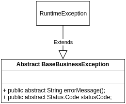

## [WIP] Lib ExceptionHandler para aplicações gRPC Micronaut 

Este repositório possui uma implementação inicial de um ServerInterceptor do gRPC capaz de tratar exceções
geradas a partir de uma rota gRPC. A princípio somente exceções que estendem de BaseBusinessException estão
sendo capturadas.

A hierarquia atual das exceções está definida desta forma:

Para testar a implementação basta executar a task `shadowJar` do projeto `micronaut-grpc-exception-handler` e
importar o jar gerado no build.gradle do projeto `exception-handler-demo` substituindo o caminho 
`implementation files("diretorio-do-jar/micronaut-grpc-exception-handler-0.0.1.jar")` pelo path onde foi salvo o jar gerado anteriormente.

### Referências
[EXCEPTION HANDLING AND ERROR PROPAGATION IN GRPC JAVA](https://sultanov.dev/blog/exception-handling-in-grpc-java-server/)
